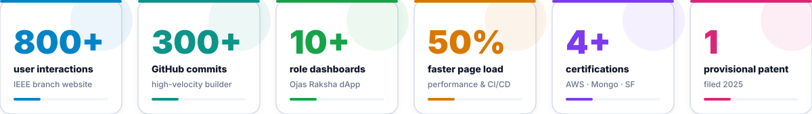
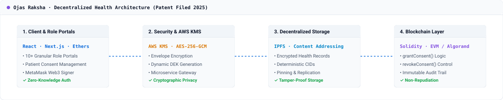
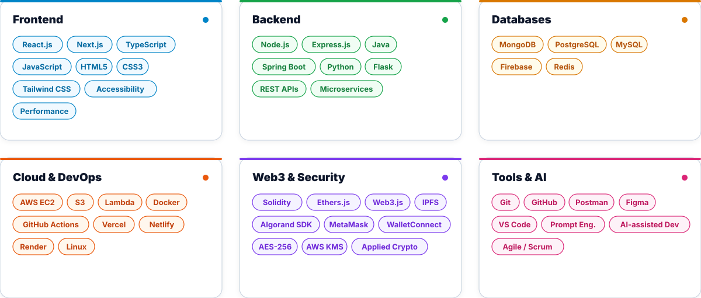
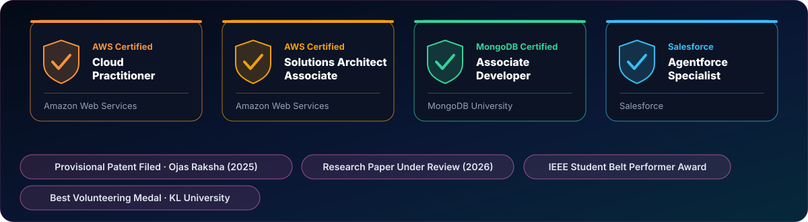

<!-- Browser Frame -->

<!-- Hero Banner -->

 

<!-- Impact Metrics -->

  

  
  
  
  
  

---

- **Focus:** Full-Stack Engineering, Cloud Architecture (AWS), Application Security & Decentralized Systems.
- **Education:** B.Tech in Computer Science & Information Technology, **KL University, Hyderabad** (2023–2027).
- **Core Philosophy:** Building scalable, secure, and resilient web infrastructure with production-ready code, cryptographic privacy guarantees, and intuitive front-end architectures.
- **Key Milestones:** Filed Provisional Patent (2025), AWS Certified Solutions Architect & Cloud Practitioner, Tech Lead @ Algorand Club, Open Source Fellow @ Good Health 24/7.

---

### 🌟 Flagship Project: Ojas Raksha
> **Decentralized, Privacy-Focused Healthcare Consent & Record Architecture**  
> *Provisional Patent Filed (2025) · Research Papers Under Peer Review (2026)*

  

- **Problem:** Centralized health databases suffer from unauthorized third-party access, lack of transparent patient consent revocation mechanisms, and single-point-of-failure vulnerabilities.
- **What I Built:**
  - **10+ Granular Role Dashboards:** Distinct tailored workflows for Patients, Doctors, Hospitals, Diagnostics, and Insurance auditors.
  - **Client-Side Envelope Encryption:** AES-256-GCM data encryption where each document is encrypted with a unique Data Encryption Key (DEK), managed dynamically through **AWS KMS**.
  - **Decentralized Storage:** Encrypted medical files pinned on **IPFS**, recording cryptographic hashes (CIDs) on EVM smart contracts.
  - **Smart Contract Access Control:** Deterministic Solidity state transitions for `grantConsent()`, `revokeConsent()`, and `verifyAccess()`.
- **Stack:** `React.js` · `Node.js` · `Solidity` · `IPFS` · `AWS KMS` · `MetaMask` · `Ethers.js` · `Tailwind CSS`

 

### Secondary Engineering Projects

#### 1. KLEF IEEE Student Branch Official Portal
*High-performance organizational portal & event management platform*
- Engineered modular React architecture supporting **800+ concurrent user interactions** during campus summits.
- Optimized bundle sizing and dynamic code splitting, achieving a **50% faster page load** and fluid mobile navigation.
- Configured automated CI/CD deployment pipelines to Vercel via GitHub Actions.
- **Stack:** `React.js` · `Tailwind CSS` · `JavaScript` · `GitHub Actions` · `Vercel`
- **Links:** [Repository](https://github.com/pmanojsai/ieee-website) · [Live Platform](https://puneethmanojsai.vercel.app)

#### 2. CollabChain
*Decentralized academic and professional credential verification system*
- Built tamper-proof credential issuance and verification pipelines utilizing Algorand smart contracts.
- Integrated IPFS pinning for immutable metadata storage, reducing verification latency from days to seconds.
- Implemented multi-signature institution approval workflows with role verification.
- **Stack:** `Algorand SDK` · `PyTeal` · `Python` · `IPFS` · `Web3.js`
- **Links:** [Repository](https://github.com/blockedge-tech/collabchain)

#### 3. AI-CQCom & AIQSec International Conference Platforms
*Official digital infrastructure for international technical conferences*
- Architected high-throughput registration, speaker schedules, and paper submission navigation systems.
- Built WCAG-accessible responsive user interfaces optimized for high concurrent traffic spikes.
- **Stack:** `Next.js` · `TypeScript` · `REST APIs` · `Tailwind CSS`

#### 4. Hexa AI Intelligent Assistant
*Multi-modal conversational assistant with external tooling integration*
- Developed contextual task automation and multi-turn conversational agents with resilient fallback handling.
- Integrated live API feeds (weather, news, computational queries) with latency-optimized response streaming.
- **Stack:** `Python` · `Flask` · `REST APIs` · `NLP` · `OpenAI API`

---

  

 

  

---

  

---

  

---

  
  

    

  

---

 

  © 2026 Puneeth Manoj Sai Pasumarthi. Built with precision, high-end engineering, and modern aesthetics.

